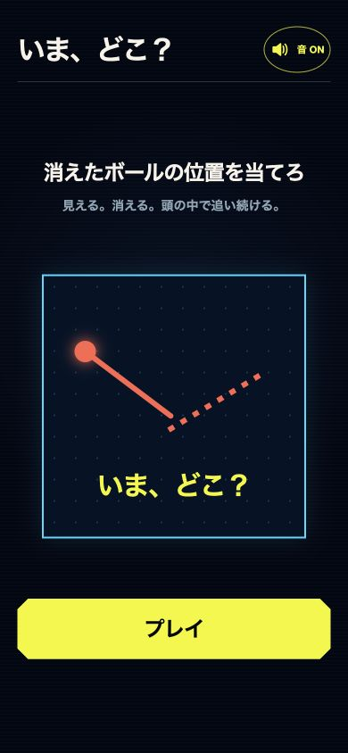
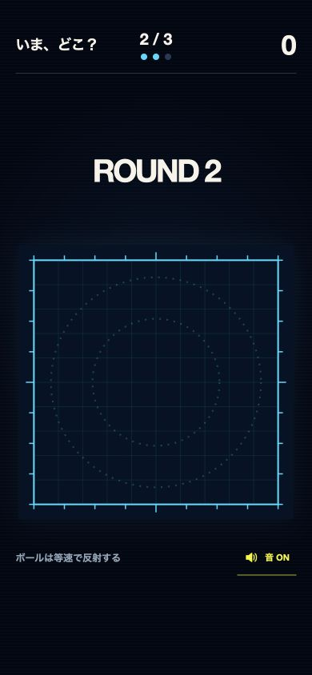
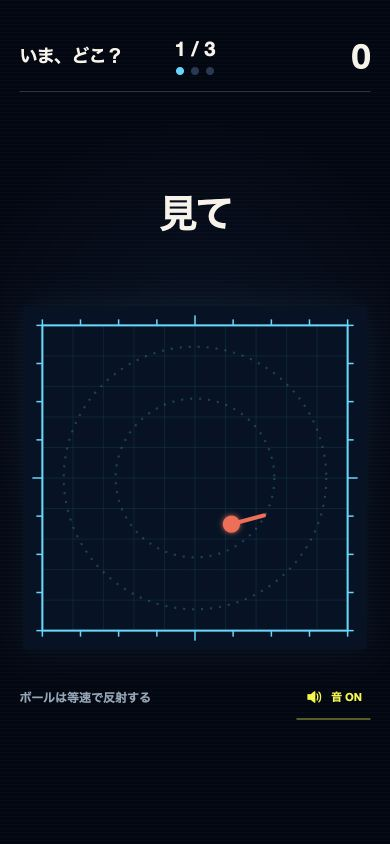
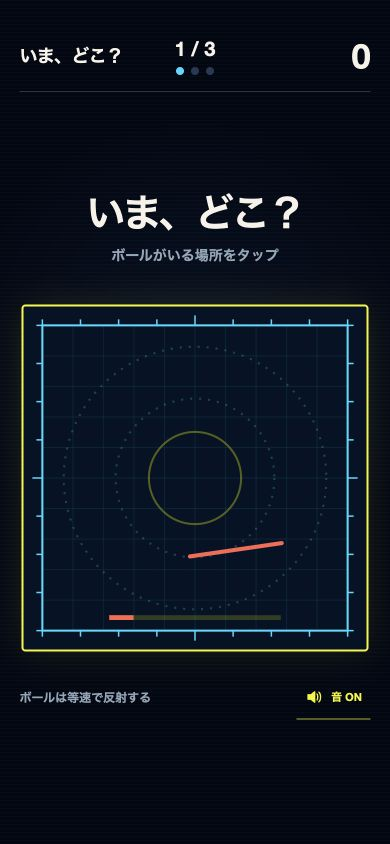
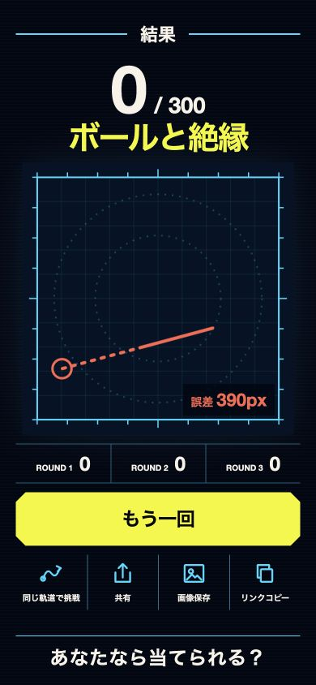

# 「いま、どこ？ — 消えたボール」ビジュアル全面レビュー

監査日: 2026-07-16

対象: 公開版 `https://8ega4.github.io/ima-doko-game/`

基準画面: 390 × 844 px（スマートフォン）
範囲: タイトル、ラウンド導入、追跡中、回答、結果、共有導線、アクセシビリティ

## 総評

現在のUIは「暗い観測装置」「シアンの計測線」「コーラルのボール」「黄色の判断」という世界観が一貫しており、MVPとしては十分に完成している。プロ品質との差は、アイデアや配色ではなく、次の4点に集約される。

1. 日本語の文字組みが端末依存で、ブランドの顔が定まっていない。
2. すべての画面がほぼ同じ明度・線密度・テンションで、ゲームの山場が弱い。
3. 結果画面に情報と操作が並列配置され、最も取ってほしい行動が曖昧。
4. Canvas操作、時間制限、縮小文字にアクセシビリティ上のリスクがある。

全面刷新は不要。既存の配色と正方形フィールドを残し、「レトロなネオンHUD」から「精密な予測装置」へ一段洗練させるのが最短ルート。

## フロー別レビュー

### 1. タイトル画面 — 良好、ブランド感は伸びしろあり

**良い点**

- タイトル、説明図、主ボタンの順番が明快で、迷わず開始できる。
- 色の役割が直感的。コーラルが対象物、黄色が操作、シアンが空間を担当している。
- 主ボタンは十分に大きく、スマートフォンで押しやすい。

**改善点**

- 見出し、説明、図中コピーのすべてが太いゴシックで、重要度の差が文字サイズだけになっている。
- `Inter` を指定しているが日本語書体は端末依存。`font-weight: 950` も実際には合成される可能性があり、端末ごとに太さと字幅が変わる。
- サウンドボタンの楕円、主ボタンの面取り、フィールドの直角という3種類の形状ルールが混在する。
- デモ図はルール説明としては分かりやすいが、実際のゲーム画面と似すぎており、タイトル画面ならではの期待感が弱い。

**改善案**

- 日本語見出し用と情報表示用の2書体に限定し、Webフォントまたは同梱フォントで表示を固定する。
- サウンド操作は44px角のアイコンボタンへ。面取りは主CTAと重要パネルだけに限定する。
- デモ図は2.4秒程度の1回完結アニメーションにし、「見える → 消える → 予測」の体験をプレイ前に見せる。
- 説明文の下に `3ラウンド / 約15秒 / 1タップ` を小さなメタ情報として追加する。

### 2. ラウンド導入 — 要改善

**良い点**

- ラウンド番号が中央に出るので、区切りは理解できる。
- ヘッダー内の進捗と得点はゲーム中ずっと同じ位置にあり、学習しやすい。

**改善点**

- フィールドが空のため、約0.5秒とはいえ「描画待ち」のように見える。
- `ROUND 2` だけが英語で、タイトルや指示の日本語とトーンが分かれる。
- 次ラウンドの難しさが見えず、単なる待ち時間になっている。

**改善案**

- `ROUND 2` と同時に `反射 1回` を表示し、難度上昇を予告する。
- フィールド枠を短く走査するライン、または開始点のパルスを出して「準備中」ではなく「計測開始」に見せる。
- 500msの静止表示ではなく、180〜240msの入場 → 300msの保持 → 追跡開始にする。

### 3. 追跡中 — 良好、主役をさらに強くできる

**良い点**

- 「見て」が大きく、ユーザーが今すべきことを一語で伝えている。
- ボールのコーラルと軌跡が暗いフィールドから明確に浮く。
- フィールドが画面中央に固定され、視線移動が少ない。

**改善点**

- 枠、目盛り、グリッド、同心円が同時に存在し、ボール以外の線情報がやや多い。
- 背景の走査線、フィールドのグリッド、円の点線が重なり、精密さより「素材を重ねた」印象が出る。
- ヘッダー、指示、フィールド、フッターの間隔が均等で、ボールへの集中を作る強弱が弱い。

**改善案**

- グリッドの線数を約30%減らし、同心円は追跡中のみさらに薄くする。
- ボールに短い残光を3〜5フレームだけ付け、速度と方向を読みやすくする。
- 追跡中は周辺UIを10〜15%減光し、ボールと軌跡だけを最明部にする。
- フッター説明は初回ラウンドだけ表示し、2・3ラウンドではフィールドを少し大きくする。

### 4. 回答フェーズ — 要改善、緊張感の核

**良い点**

- シアンから黄色の外枠に切り替わり、操作可能になったことは視覚的に伝わる。
- 指示が `いま、どこ？` と `ボールがいる場所をタップ` に絞られている。

**改善点**

- カウントダウンがフィールド下端の細いバーだけで、注視点から離れている。
- 中央のパルスは「ここを押す」ターゲットにも見え、自由な位置を選ぶゲームと競合する。
- 2秒の時間制限に対して、回答可能になった瞬間の変化が枠色だけでは弱い。

**改善案**

- 中央パルスを廃止し、フィールド外周を減っていくタイマーにする。視野の端で残り時間を把握できる。
- 回答開始時にフィールドを1回だけ明滅させ、短い音と触覚を同期する。
- タップ直後は推測点を大きく打ち、正解点 → 誤差線 → 得点の順に200ms刻みで表示する。
- 答え合わせは現状の1.1秒から1.5〜1.8秒へ延ばすか、タップで次へ進めるようにする。

### 5. 結果画面 — 構造改善の優先度が最も高い

**良い点**

- 合計点、称号、誤差、ラウンド別得点が一画面に収まり、成果を理解しやすい。
- 軌跡が残るため「なぜこの点数だったか」を視覚的に振り返れる。
- 再挑戦ボタンが最も目立つ。

**改善点**

- 合計点、称号、軌跡、誤差、3ラウンド得点、再挑戦、4共有操作、末尾コピーがすべて強く、視線の終着点がない。
- 共有系4ボタンが同じ強さで並び、`同じ軌道で挑戦` は実際にはX投稿を開くため、文言と挙動が一致しにくい。
- 共有ラベルは最小9pxまで縮小し、プロ品質の可読性としては小さすぎる。
- `あなたなら当てられる？` が画面内CTAではなく、共有画像用コピーの残置に見える。

**改善案**

- 上半分を1枚の「結果カード」にまとめ、点数・称号・代表軌跡を一つの構図として完成させる。
- 主CTAを `もう一度プレイ`、副CTAを `友だちに挑戦状を送る` の2つに絞る。
- `画像保存` と `リンクコピー` は `その他` または共有シート内へ移す。
- 自己ベスト更新時のみ `NEW BEST` を黄色の小さなバッジで表示する。
- 末尾コピーは削除し、共有CTAの補足文 `同じ軌道を送れます` に置き換える。

## 推奨するビジュアル方向

### コンセプト: Precision Arcade Instrument

「ネオンゲーム」ではなく「一瞬の物理予測を測る精密機器」として整える。

- **背景:** 現在の濃紺を維持。走査線は半減し、面の静けさを増やす。
- **シアン:** 枠・計測・進捗だけに使う。
- **コーラル:** ボール・正解点・誤差だけに使う。
- **黄色:** 押せる場所・制限時間・自己ベストだけに使う。
- **白:** 指示と得点。補助情報は彩度を落とした青灰色。
- **形状:** 直角を基本にし、12pxの面取りは主CTAと結果カードだけに限定。
- **線:** 1px、2px、4pxの3段階に固定。アイコンは24px、1.75〜2px strokeで統一。

### タイポグラフィ

- 見出し: 日本語表示が安定する太字フォントを同梱し、800〜900の範囲に限定。
- 数字・ラウンド情報: 幅の安定した英数字用フォントを使い、スコアの計器感を出す。
- 本文: 14〜16px、補助情報でも12px未満にしない。
- 極端な負の字間（`-.07em`）を見出し以外から外し、日本語の詰まりを軽減する。

### モーション

- 画面遷移: 180〜240ms。
- ラウンド開始: 走査 → ボール点灯 → 移動開始。
- 消失: ボールを縮小させず、残光だけが50〜100msで消える。
- 回答: 枠色変更と短い触覚を同期。
- 答え合わせ: 推測点 → 正解点 → 誤差線 → 得点の順で段階表示。
- `prefers-reduced-motion` では揺れ・パルス・残光を止め、フェードなしの状態切替にする。

## アクセシビリティ上のリスク

スクリーンショットと現行コードから確認できる範囲の指摘であり、完全なWCAG適合確認ではない。

1. ゲームCanvasはポインター操作のみで、キーボードフォーカスと代替入力がない。矢印キーで照準移動、Enterで決定できるモードを用意する。
2. フェーズ表示は`aria-live="polite"`だが切替が速く、読み上げが操作時間に間に合わない可能性がある。開始前の準備操作と、時間制限なしのアクセシブルモードを検討する。
3. `prefers-reduced-motion` はCSSの画面揺れには効くが、Canvas内のボール・パルス・タイマーには反映されない。
4. 結果画面の9〜10pxラベルは小さい。最低12px、通常14pxを基準にする。
5. `min-width: 320px` は拡大表示時の横スクロール要因になり得る。200%ズームと320px幅でリフロー確認が必要。
6. 結果Canvasは誤差値だけを読み上げる。ラウンド、得点、推測位置と正解位置の関係をテキストでも提供する。

## 実装優先順位

### P0 — プロ品質の土台

1. 書体を固定し、文字サイズ・ウェイト・行間・字間のトークンを定義する。
2. 結果画面を「結果カード + 2つのCTA」に再構成する。
3. 回答開始と答え合わせの状態変化を強化する。
4. 9〜11px文字を解消し、Canvasのキーボード操作とreduced-motion対応を設計する。

### P1 — 見た目の完成度

1. 背景・グリッド・同心円のノイズを減らし、主役のコントラストを上げる。
2. タイトルのデモ図を短い体験アニメーションへ変更する。
3. 形状、線幅、アイコンのルールを統一する。
4. ラウンド導入で反射回数を予告し、難度上昇を演出する。

### P2 — 仕上げ

1. 自己ベスト更新、90点以上、完全一致などの特別演出を追加する。
2. 共有画像とアプリ画面の文字組み・余白・配色を同じデザインシステムへ統合する。
3. 小型端末、横向き、200%ズーム、ハイコントラスト設定で回帰確認する。

## 完了条件

- 320 × 568、390 × 844、430 × 932で情報欠けと横溢れがない。
- 本文14px以上、補助ラベル12px以上、操作領域44 × 44px以上。
- タイトル、追跡、消失、回答、答え合わせ、結果の各状態が静止画だけでも判別できる。
- 通常モーションとreduced-motionの両方で3ラウンド完走できる。
- 結果画面で5秒以内に「得点」「称号」「次の主操作」が読み取れる。
- キーボードだけで開始、位置選択、結果確認、再挑戦まで完了できる。

## 証拠上の制約

- 公開版の390 × 844表示を実機相当のブラウザ画面で確認した。
- タイトル、ラウンド導入、追跡中、回答、結果を撮影した。
- 答え合わせは表示時間が短く、今回の監査では独立した静止画を保存できなかったため、結果画面と現行描画コードから評価した。
- キーボード操作、スクリーンリーダー、200%ズーム、実端末の触覚・音声は今回のスクリーンショット監査だけでは確認していない。
